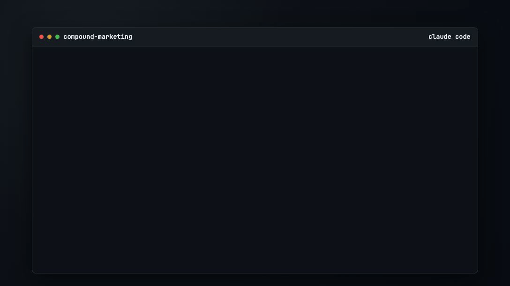

# Compound Marketing Agent

Analyses marketing campaign metrics and recommends the highest-leverage growth experiment to test.

No coding experience required.



## Quick start

**Prerequisite:** Claude Code installed and authenticated. [Setup instructions](https://code.claude.com/docs/en/quickstart).

1. Paste this command into **Terminal** (Mac) or **PowerShell** (Windows):

```bash
git clone https://github.com/ryan-hennebry/compound-marketing.git && cd compound-marketing && claude --dangerously-skip-permissions
```

2. In Claude chat, complete onboarding. The agent starts from your company URL or name, generates the first recommendation in Claude Code, and only offers delivery setup after value has been shown.

## The onboarding flow

- Share your company URL or company name
- The agent researches your positioning, audience, differentiators, and proposes 3-5 company perceptions to validate
- Choose which channels to track
- If a channel needs access, the agent walks you through connecting it or using CSV/manual input
- The agent reviews performance patterns and generates the first recommendation
- Delivery stays optional until that first recommendation exists

## Visual proof

- `assets/cli-demo-full.gif`: onboarding from company URL to first recommendation and delivery opt-in
- `assets/how-it-works-light.svg` / `assets/how-it-works-dark.svg`: the actual setup, recommendation, and compounding loop

## What you receive

Each cycle produces one recommendation with:

- Signal context: whether the change looks meaningful or more likely to be noise
- A short brief covering the goal, audience, channels, and creative direction
- Customer-story framing for the draft
- A one-sentence recommendation summary with expected impact and confidence
- Draft content in the right format for the chosen channel
- Learnings applied from previous approvals, edits, rejections, and results

## Once your first recommendation has been generated

Keep working with the agent in Claude Code for deeper analysis:

- "Show me which part of this recommendation is driven by real signal versus sparse-data fallback."
- "Which validated learnings shaped this draft, and which assumptions are still unproven?"
- "If we reject this, what learning would you record so the next recommendation improves?"
- "Show my last 10 recommendations split by optimization, experiment, and exploration."
- "Where are we overweight on Fuel versus Engine, and how should that change the next cycle?"

## Delivery options

Delivery is only offered after the first recommendation exists.

- **Manual in Claude Code** (default): review, approve, edit, or reject recommendations directly in chat
- **Email via Resend:** when the agent asks, open [Resend](https://resend.com/api-keys), create an API key, and paste it into chat. The agent will then ask for the sender email and delivery inbox
- **Slack via incoming webhook:** when the agent asks, open [Slack app setup](https://api.slack.com/apps), create an Incoming Webhook for the channel you want, and paste the webhook URL into chat
- **Email + Slack:** full recommendation by email, condensed notification in Slack

You can set up or change delivery directly in chat.

## How it works

<picture>
  <source media="(prefers-color-scheme: dark)" srcset="assets/how-it-works-dark.svg">
  
</picture>

*Diagram source: `assets/how-it-works.mmd`.*

## The agent's output

- `marketing.db` -> all mutable state: company profile, channels, metrics, recommendations, learnings, delivery settings, and run history
- `CLAUDE.md` -> the working method: baseline comparisons, signal checks, recommendation structure, customer-story framing, quality gates, and delivery logic
- `run.sh` -> scheduled entry point that runs `claude --dangerously-skip-permissions -p "Generate today's marketing recommendation. Follow CLAUDE.md methodology."`
- `init_db.sql` -> the SQLite schema used by `marketing.db`

You can use the agent manually in Claude Code or schedule `./run.sh` once onboarding is complete.

## Project standards

- [MIT License](LICENSE)
- [Security Policy](SECURITY.md)
- [Contributing Guide](CONTRIBUTING.md)
